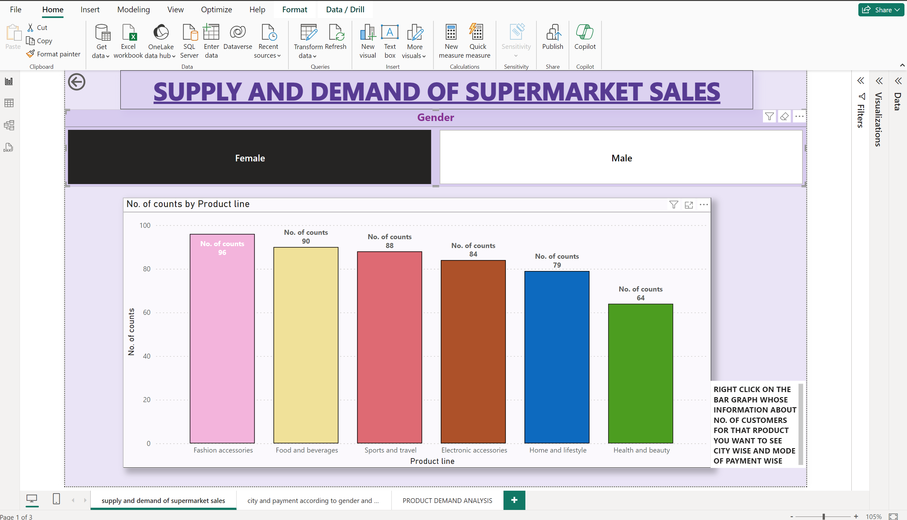
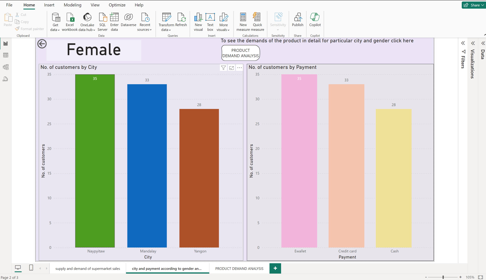
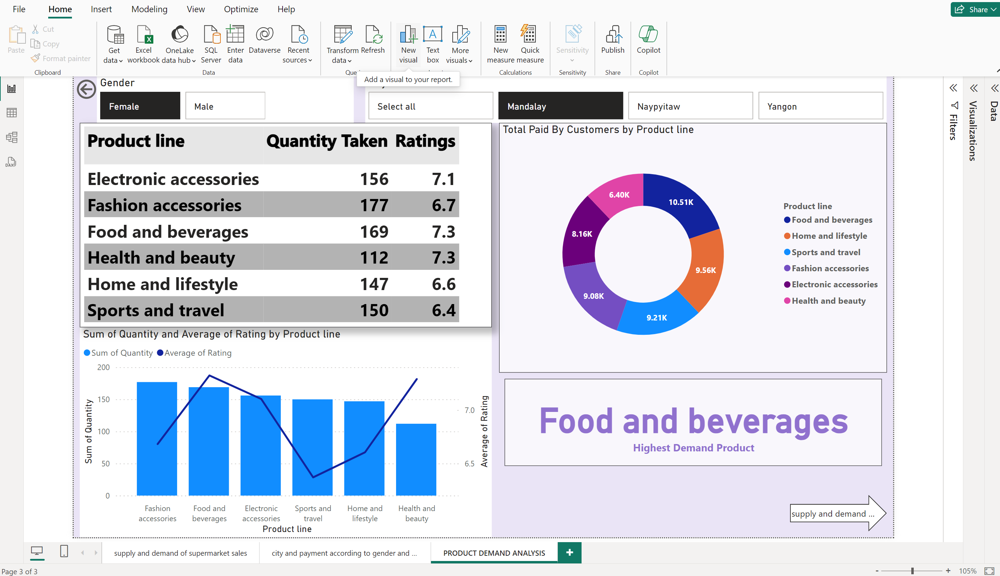

### Introduction-
Welcome to the Supermarket Sales Analysis project! This Power BI dashboard provides comprehensive insights into the supply and demand dynamics of supermarket sales. By analyzing sales data, inventory levels, and customer behavior, this dashboard aims to optimize inventory management and maximize sales revenue.

### Data Sources-
The data used in this project is sourced from various internal sources within the supermarket chain, including:
Point of Sale (POS) systems
Inventory management systems
Customer relationship management (CRM) platforms
Supplier databases

Features
1. Sales Overview
The Sales Overview dashboard offers a snapshot of key sales metrics, including:
Total sales revenue
Sales trends over time
Product categories with the highest sales
Customer segmentation analysis
2. Demand Forecasting
The Demand Forecasting dashboard utilizes historical sales data to predict future demand and optimize supply chain operations. It features:
Sales forecasts by product and region
Seasonal demand analysis
Forecast accuracy metrics
4. Supplier Analysis
The Supplier Analysis dashboard evaluates the performance of suppliers and identifies opportunities for cost savings and efficiency improvements. It includes:
Supplier lead times
Purchase volumes by supplier

### Analysis-
1. First, we created a slicer of gender to distinguish the information gender wise and then we created a graph by transforming data first and counting number of females and males in each product line. In the graph according to gender than we can see the number of items purchased by that gender in different categories. In the picture we can see we have selected female from the slicer and then number of items of different categories purchased by females can be seen in the graph.
2. Then we created another page in which we mentioned no. of customers by city and by mode of payment. 
3. I created a drill through to that is according to product line selected from the previous graph we can see the males or females(as per selection) in which city did they belong and modes of payment they used.
4. In this page I also created a button to navigate to next page in which demand analysis has been done. In this picture I selected foods and beverages product purchased by female which drill us through the analysis of females’ city wise and modes of payment they used.
5. In the third page, I created 4 visualisations. First one was a table visual in which each product line with its sum of quantity purchased and overall ratings by them is mentioned.
6. In the second one a line cum bar chart in which quantity and its ratings can be analysed according to information in the table
7. In the third visual I created a gauge chart in which total sales by each product has been mentioned and in fourth one through measures I created a face card in which name of product with maximum demand will be mentioned.
8. Then I created 2 slicers one for gender and other for city so that we could see all this information gender and city wise and accordingly the demand analysis can be done. In this picture I selected Female of Mandalay city so we could see first number of quantities and their overall ratings of each product, second the sales that has been done for each product and in Mandalay Females highest demand product is in Foods and Beverages.

Contact Information
For inquiries or support regarding this project, please contact Arsh Zehra at zehrarsh@gmail.com.
